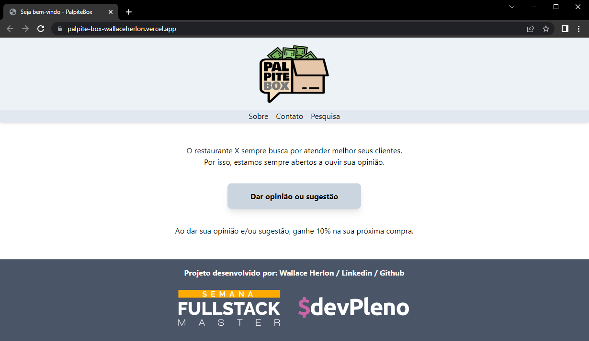
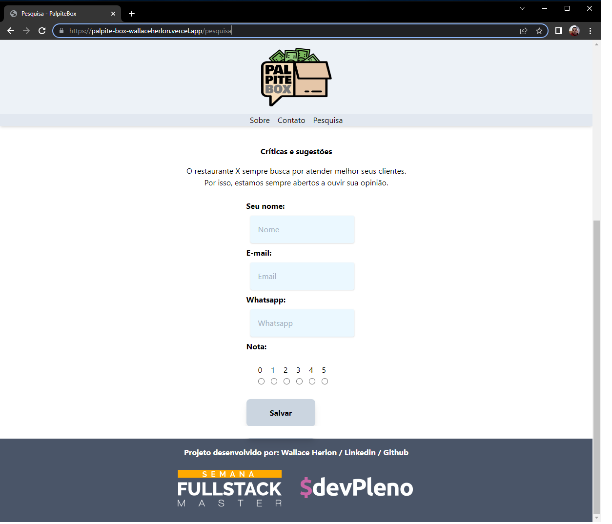

<h1 align="center">Semana Fullstack Master</h1>

[](https://hits.dwyl.com/WallaceHerlon/palpite-box)


Este projeto foi construído durante a Semana Fullstack Master do [DevPleno](https://devpleno.com). Uma versão online deste projeto pode ser encotrado em: https://palpite-box-wallaceherlon.vercel.app/. 







## Início

Essa aplicação gera cupom de desconto pro cliente, ao preencher um formulário de pesquisa colocando alguns dados pessoas como nome, e-mail, numero WhatsApp e a nota do estabelecimento, quando confirma o envio dos dados o cupom e gerado é terá um desconto na próxima compra.

## Layout

Antes de partir para código foi realizado um layout utilizando o Figma. Você pode encotrar o arquivo [aqui](https://www.figma.com/file/DsAUsSqeCQoSLwk0sX1GRB/palpite-box?node-id=0%3A1 )


## Pré-requisitos:

Você precisa do NodeJS e do NPM instalado em sua máquina.

```
npm install
npm run dev
```

## Colocando em produção:

Este projeto pode ser colocado em produção utilizando o Vercel. É necessário criar as variáveis de ambiente para configurar o acesso as planilhas do Google:

```
SHEET_CLIENT_EMAIL=client email do service credential
SHEET_PRIVATE_KEY=private key do service credential - lembrar de substituir \n por quebras de linha e de codificar em base 64
SHEET_DOC_ID=id da planilha
```

## Construído com:

* [NextJS](https://nextjs.org/) -The React Framework.
* [TailwindCSS](https://tailwindcss.com/) - A utility-first CSS framework for
rapidly building custom designs.
* [Figma](https://figma.com/) - Online prototyping tool.
* [Google Sheets](https://drive.google.com) - Planilhas online do Google

## Author:

* **Wallace Herlon** - [LinkedIn](https://www.linkedin.com/in/wallaceherlon/)

## Acknowledgments

* Este projeto foi construído durante a Semana Fullstack Master do [DevPleno](https://devpleno.com).